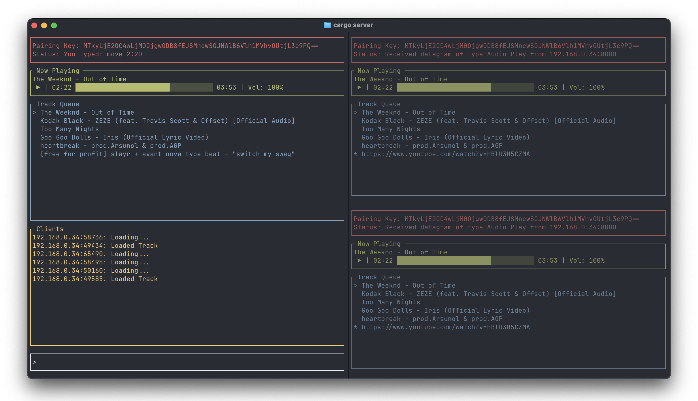
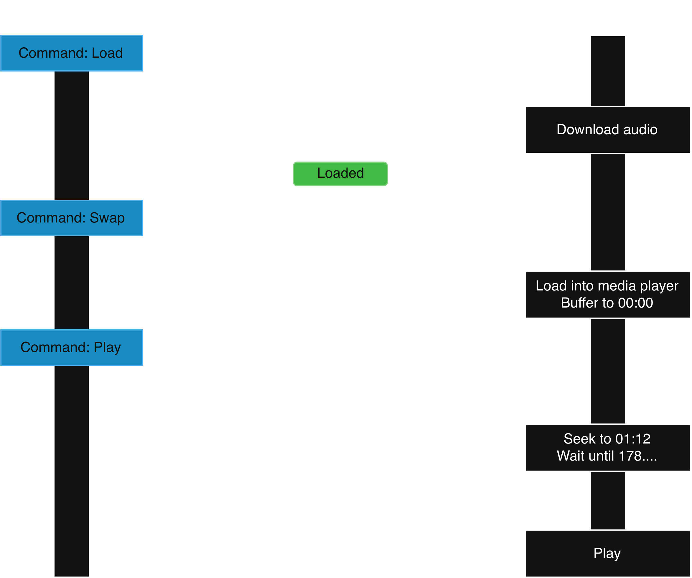
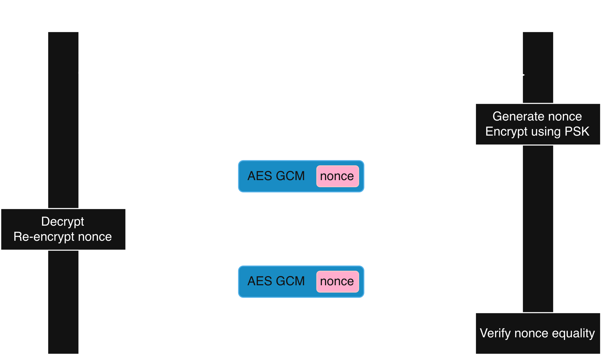

# Jitterbug
A network protocol and terminal application for orchestrating synchronized audio playback across devices.

# Purpose
Making audio play at the exact same time on multiple devices is difficult. Differences in network speed and operating system make perfect synchronization challenging, often leading to chaotic echos and discernable lag.
This project aims to reduce jitter by syncing at a lower level, getting closer to the actual audio output. It involves using one device as a server, which instructs independent clients to load and play audio. The playback is orchestrated over a custom protocol (see below).

# Technical aspects
- A custom protocol over UDP with AES-GCM-128 authenticated encryption.
- Playback sync using pre-scheduled unix timestamps, and pre-buffering of audio files.
- Async Rust (Tokio) with background task decoupling for downloading (does not block the TUI).
- Ratatui terminal UI with live client and queue status.

<figure>
  
  <figcaption align="center">A server connected to 6 clients, 2 of which are on the same device.</figcaption>
</figure>


# How to use

## Dependencies
- The following dependencies are necessary
    - Rust (1.85+)
    - ffmpeg ```brew install ffmpeg``` or ```winget install yt-dlp```
    - yt-dlp ```brew install yt-dlp``` or ```winget install -e --id Gyan.FFmpeg```
- If a download failes with `403`, run `yt-dlp -U` to update yt-dlp. Youtube's extraction requirements change frequently, but yt-dlp is on top of adapting to them.
- You must be logged into YouTube in Chrome (or similar browser), due to CDN restrictions. When running, the program will ask to access the necessary cookies. If you use a browser other than chrome, change the BROWSER constant in `src/constants.rs` to your prefered browser.

## Initialization
- Spin up a server
```bash
cargo server
```
- Spin up clients
```bash
cargo client
```
- You may see a firewall permission prompt on first launch, which you should allow.

## Usage
- Connect clients to the server by entering the sharing key.
- Use the following commands on the server input:
    - `load <youtube URL>`: Download an audio file for the given URL.
    - `swap`: Swap in the next track in the queue and buffer it to 00:00. Delete the downloaded file of the previous track.
    - `play`: Play the current track.
    - `pause`: Pause the current track.
    - `forward`: Skip forward 5 seconds.
    - `backward`: Skip backward 5 seconds.
    - `vol <0-100>`: Set the volume to the given percentage.
    - `move <seconds or mm:ss>`: Move to the given timestamp.
- Concurrency is (mostly) supported. Multiple audio files can be loaded simultaneously, and play/pause/volume and 
other instant commands can be used while a track is loading.


# Inspiration
This project was inpired a longstanding want for a simple music syncing tool. I'd initially tried a web-based version, [YouSync](https://github.com/skparab1/yousync), but realized that it was trying to sync from too high a level, and discrepancies arising from different browsers and other systems between the browser and the speaker made it difficult to achieve a jitter-free surround sound experience. This project aims to sit at a lower level, avoiding the browser's audio sandboxing, and has been more successful in syncing, in my experience. Note that the custom network in this project isn't really necessary, but it does transmit the minimum data necessary and is less complex than TCP (though I could have just used a module, designing and implementing this protocol was fun).

# How it works
## Playback
- One instruction orchestrates independent client tasks, each running its own async event loop with background-decoupled downloads.
- Playback flow:
    - The server sends a `load <URL>` command. This tells the client: "independently download the audio content from the given URL, and report when done". The client reports when the file is downloaded, and adds it to its queue.
    - The server sends a `swap` command. This tells the client: "swap in the file at the top of the queue and buffer it to 00:00. Be ready for my play signal".
    - The server sends a `play` command. This signal comes with a specific playback timestamp (like 01:11) and a unix timestamp. This tells the client: "wait until `unix timestamp`, then play the current audio at `timestamp`".
- Instructions like volume, and pause are actioned immediately.

<p align="center">
    
</p>

## Protocol
### Frame
- The frame was meant to be minimal. It looks like:
    - magic bytes: 4 bytes      [raw]
    - nonce: 12 bytes           [raw]
    - packet type: 1 byte       [encrypted]
    - sequence number: 4 bytes  [encrypted]
    - payload: up to 227 bytes  [encrypted]
    - AEAD tag: 16 bytes        [encrypted]
- The encrypted portion is encrypted using AES-GCM-128, with a pre-shared-key (see below) the attached nonce.

### Handshake
- PSK share: The server generates a common pre-shared-key (PSK), which will be shared with all clients out of band (by text).
- SYN: The client generates a nonce, encrypts it with the the PSK (AES-GCM-128), and sends it to the server.
- The server decrypts the payload, obtaining the nonce. Since this is AEAD, if the client does not have the PSK, this will fail.
- ACK: The server re-encrypts the nonce with the PSK, and sends it back to the client. This reply looks different because the AES-GCM-128 nonce is difference.
- Verify: The client verifies that returned nonce matches, and confirms the connection.

<p align="center">
    
</p>

## Terminal Application
- The terminal UI is made using Ratatui. It has the following components
    - Status: States what's just happened, for example loaded a track or received an instruction.
    - Now Playing: The current track, playing/paused status, progress bar of duration, and volume.
    - Track Queue: Queue of next tracks, with `>` indicating the current track and `*` indicating a loading track.
    - Clients (server only): List of connected clients, and whether they have loaded the requested track.
    - Input (server only): Enter commands like load, play, pause.

## Known limitations
- Packet loss: Most protocols built on top of UDP feature their own packet delivery guarantees. With the exception of acks for handshake and loading, this does not. I reasoned that adding an ack for play and pause would add unnecessary complexity, as a simple one way signal of (server) "play" becomes (server) "play" -> (client) "ok" -> (server) "now actually play", and what if one of these packets gets dropped? Instead, if a client does fail to action a signal, it can just be repeated with another play/pause command, which is idempotent.
- Crashing: Though uncommon, I've sometimes seen this program crash due to some audio encoding issue, which sometimes happens if a misreported audio length causes the decoder to panic because it runs out of samples. This is actually a [known issue](https://github.com/RustAudio/rodio/issues/496) with rodio, and I'm working on putting in some workarounds.
- Restrictions: Most public WiFis isolate clients so that they can't talk to each other. Thus, this can only be run over a LAN without client/AP isolation enabled. So, most home/private WiFis should work, but public and enterprise WiFis may not.
- Speed: Loading is honestly extremely slow: it can take up to 45 seconds even for smaller files. I'm looking into ways to speed this up, but for now I don't anticipate it being too much of an issue, as multiple tracks can be loaded simultaneously, and the next track can be loaded while the current track is playing. The yt-dlp download is actually pretty fast, I think the conversion process could be sped up.